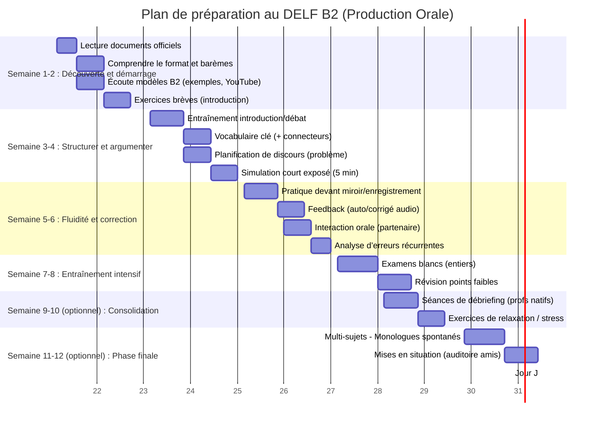

# Rapport de préparation au DELF B2 – Épreuve orale

**Résumé exécutif :** Ce rapport fournit une préparation exhaustive à l’épreuve orale (production orale) du DELF B2 « tout public » (France Éducation International/CIEP). Il compile notamment les informations officielles (description de l’épreuve, grilles et critères de notation) et des ressources d’exercices et de modèles (sites web, livres, MOOCs, etc.), le tout annoté (cible, coût) et classé par catégorie. Sont également présentés des modèles de structure (introduction, développement, conclusion pour le monologue ; techniques de prise de parole pour l’échange), plusieurs exemples de scripts corrigés, un plan d’étude progressif de 8–12 semaines (avec diagramme Gantt Mermaid), ainsi que des indicateurs d’auto-évaluation alignés sur les descripteurs DELF B2. Ce guide, privilégiant les sources officielles et les contenus en français, s’adresse à la fois à l’auto-apprenant et à l’enseignant, avec un grand souci de clarté et de détaillage à chaque étape.

## 1. Épreuve orale du DELF B2 – descriptif officiel

L’épreuve de **production orale** du DELF B2 dure environ 20 minutes en face-à-face (plus 30 min de préparation). Elle se compose de deux parties : 
- **Monologue suivi (5–7 min)** : l’examinateur donne au candidat un bref document écrit (article, interview, texte d’opinion…) sur un thème de société. Le candidat doit « dégager le problème soulevé par le document » et *« présenter [s]on opinion sur le sujet de manière claire et argumentée »*【32†L6-L14】【37†L106-L114】. Il est évalué sur sa capacité à organiser et justifier un discours (voir grille ci‑après).  
- **Interaction / débat (10–13 min)** : l’examinateur (ou jury) engage un échange avec le candidat. Il attend que le candidat « défende son point de vue », puisse *« réagir aux arguments et déclarations d’autrui »* et nuancer son opinion【32†L10-L20】【37†L167-L175】.  

Chaque tâche est notée sur 25 points (total 100 pts pour l’examen). Le candidat doit obtenir au moins 50/100 au total, avec au minimum **5/25 dans chaque épreuve** sous peine d’élimination【16†L0-L4】. Les grilles d’évaluation officielles décomposent la note orale en **5 points par critère** : réalisation de la tâche (monologue 5, interaction 5) et **compétence linguistique** (lexique 5, morphosyntaxe 5, prononciation 5)【15†L39-L47】【13†L25-L33】. 

L’*équilibre pratique* est résumé dans le « Manuel du candidat » : le monologue (défense d’un point de vue) doit durer 5–7 min, suivi immédiatement d’un débat de 10–13 min【25†L32-L40】. Le candidat pioche deux sujets et en choisit un. L’énoncé officiel précise : *« Vous présenterez votre opinion sur le sujet de manière claire et argumentée. Vous défendrez votre point de vue au cours du débat »*【32†L15-L23】. 

Les **descripteurs de performances** officiels (France Éducation international) indiquent qu’un bon candidat B2 doit être capable, par exemple, d’*« introduire la problématique », « développer de nombreux arguments étayés d’exemples », « produire un discours clair, fluide et bien structuré en utilisant une variété de connecteurs »*【13†L23-L28】. Pour l’interaction, le candidat B2 *« peut exposer son opinion et argumenter avec précision, élargir la discussion, réagir aux arguments d’autrui de façon convaincante »*【13†L38-L42】. Ces critères reflètent directement les attentes du Cadre européen (CECR) : en oral l’apprenant B2 « peut exposer ses opinions et les défendre avec pertinence en fournissant explications et arguments »【4†L329-L333】, « communiquer spontanément […] sans donner l’impression de limiter ce qu’il veut dire »【4†L321-L327】, etc. 

En résumé, le candidat doit avant tout **structurer son discours** (introduction-développement-conclusion), **argumenter** de manière nuancée avec connecteurs logiques, et **communiquer clairement** plus que chercher des tournures trop complexes【31†L276-L284】【37†L147-L155】. Le jury évaluera à la fois le contenu (idées, argumentation, pertinence) et le code linguistique (richesse du vocabulaire, grammaire et accent). Toutes ces informations officielles figurent sur le site de France Éducation international (CIEP)【25†L32-L39】【37†L81-L90】 et dans le *Manuel du candidat* (cf. Ressources).

## 2. Structures-types (modèles) pour l’oral

### 2.1. Modèle de monologue suivi (exposé)

Un monologue B2 bien réussi respecte généralement la structure suivante :  

- **Introduction (1 min)** : présenter le document-déclencheur et son thème. Citer la source (titre, auteur, date) pour situer le contexte【18†L128-L134】, puis reformuler le problème/la question soulevée sous forme de problématique. Par exemple : « Cet article titre <…>, l’auteur(s) y présente que **…). Par conséquent, nous pouvons nous demander si… »【24†L92-L100】. Enfin, annoncer brièvement le plan (« Dans cet exposé, j’aborderai d’abord X… puis Y… »)【18†L131-L139】【24†L95-L100】. *Astuce* : on peut d’ailleurs préparer ou même rédiger à l’avance l’introduction, pour se lancer plus sûr de soi【18†L125-L133】.  

- **Développement (6–8 min)** : formuler 2 à 3 arguments **clairs et illustrés par des exemples** concrets (anecdote personnelle, données sociétales, expérience)【37†L106-L114】【13†L25-L28】. On peut organiser soit sous forme « pour et contre » (avantages/ inconvénients)【24†L55-L64】【22†L152-L160】, soit problème/solutions, soit points en faveur /points défavorables, selon la consigne. Chaque argument (ou groupe d’arguments) est introduit par un connecteur logique (« Premièrement… Ensuite… De plus… Cependant… En conclusion de cette partie… »【18†L123-L132】【24†L104-L112】). Les transitions (fin de partie→début suivante) sont essentielles (« J’ai évoqué X, je vais maintenant aborder Y », «Pour finir cette partie, notons que… / Passons maintenant à… »【24†L107-L110】). *Phrase-clés utiles* : « Selon moi… / À mon avis… / Je suis convaincu(e) que… / Cela s’explique par… / Par exemple… / En effet… / D’après… » etc.【37†L130-L139】【31†L274-L279】.  

- **Conclusion (1 min)** : résumer succinctement son opinion finale en réponse à la problématique posée (« En conclusion, le document met en lumière que… À mon sens, il est clair que…»【24†L111-L118】). Ouvrir éventuellement sur une perspective plus générale ou sur une question plus large. Par exemple : « Pour ma part, je suis persuadé(e) que… et je conclurai que… Pour aller plus loin, on pourrait aussi s’intéresser à… »【37†L106-L114】【31†L276-L284】. 

**Plan type (exemple)** :  
> **I.** (Point 1 : argument principal ou inconvénient) – explication + exemple(s) – connecteur de transition  
> **II.** (Point 2 : argument principal opposé / complément) – explication + exemples – transition  
> *(III. optionnel)* (Point 3 ou point de vue nouveau) – plus exemples  
> **Conclusion :** Réponse à la question ; synthèse + perspective.  

Cet outline simple à trois étapes (intro, *2–3 arguments*, conclusion) correspond exactement aux attentes du jury : « Introduction – 2 ou 3 arguments illustrés – Conclusion répondant à la question posée »【24†L41-L48】【37†L106-L115】. On insiste sur la qualité de la **liaison logique** : varier les connecteurs (« d’abord, ensuite, or, par ailleurs, en revanche, enfin »【18†L133-L142】【24†L102-L111】) pour lier les idées. Il vaut mieux développer pleinement deux arguments qu’en énumérer cinq superficiellement【37†L106-L114】. Enfin, parlez calmement et naturellement, sans lire un texte appris par cœur【37†L147-L155】. En cas d’hésitation ou d’erreur, reformulez, faites une pause (« juste un instant… ») ou répétez la phrase autrement.

### 2.2. Modèle d’échange interactif (débat avec le jury)

Dans la deuxième partie (interaction avec les examinateurs), le candidat doit réagir aux questions, défendre et nuancer son opinion, etc. Quelques principes-clés et expressions utiles :  

- **Écoute active et prise de temps** : Écoutez la question **entièrement**. Il est permis de prendre une seconde pour réfléchir (« Je réfléchis… ») avant de répondre【37†L167-L175】. Montrez votre intérêt (« Ah bon ? / D’accord, je vois… »).  
- **Gérer la parole** : Parlez un peu plus lentement que d’habitude. Si deux examinateurs parlent, établissez une stratégie (parler à l’un puis à l’autre, ou alterner les questions). Précisez à qui vous répondez: « Oui, vous, Madame / Monsieur… / Comme le disait X… ». Une simple phrase d’excuse permet de prendre la parole : « Si vous me permettez de répondre… », « Excusez-moi, je voulais ajouter… ».  
- **Structures utiles** : Utilisez les marqueurs conversationnels : « Effectivement… / En fait… / Vous avez raison… / D’accord, mais… / Permettez-moi de nuancer : / Au contraire… »【24†L131-L140】. Pour gagner du temps, recourez à des fillers politesse : « C’est une bonne question… / Eh bien… / Alors… disons que… / Comme je le disais tout à l’heure… ».  
- **Clarification et reformulation** : Si vous n’avez pas compris une question, dites-le poliment : « Pouvez-vous préciser votre question ? / Je ne suis pas sûr d’avoir bien saisi… ». Pour reformuler la question, commencez par « Donc vous me demandez… / Vous voulez savoir si… c’est ça ? ».  
- **Nuancer et défendre son opinion** : Répondez aux arguments de l’examinateur en faisant référence à ce qu’il vient de dire : « Je comprends votre point de vue, toutefois… / Vous avez raison sur X, cependant je pense que Y… / Oui, c’est vrai que…, mais il faut aussi considérer… »【24†L153-L162】. Montrez que vous savez concéder une part de vérité (« C’est un bon argument / Je vois ce que vous voulez dire, il est vrai que…, cependant… »).  
- **Expressions types** : Accord/désaccord (« Je suis tout à fait d’accord / pas du tout d’accord avec… »【24†L131-L138】), opinion personnelle (« À mon avis, selon moi, en ce qui me concerne »), doute ou incertitude (« Je ne suis pas sûr(e) que… / Il me semble que… / Je ne suis pas certain(e)… »), concession (« C’est vrai, mais… / D’un côté… de l’autre côté… »【24†L153-L162】).  

Les entraînements montrent que le jury souhaite juger votre **capacité à réagir** plus qu’à trouver absolument la « bonne » réponse. Il est donc préférable de parler clairement, corriger ou reformuler un point si nécessaire, sans s’arrêter indéfiniment sur une erreur isolée【37†L147-L155】. Une seule erreur mineure (faute de grammaire, hésitation) ne coûte pas l’examen si le reste est fluide【37†L193-L196】. Au contraire, restez poli et posé ; maintenir le contact visuel, respirer calmement. 

**Tableau de synthèse – échanges avec le jury :**

| Stratégie | Exemple de phrase |
|---|---|
| Réponse organisée | « D’abord, je voudrais dire que… Ensuite… Enfin… »【18†L133-L142】 |
| Accord / désaccord | « Je suis d’accord avec vous que X, mais d’un autre côté… / Non, je ne suis pas d’accord »【24†L131-L140】 |
| Nuancer | « Vous avez un point, cependant… / Je comprends votre argument, toutefois… »【24†L153-L160】 |
| Clarification | « Excusez-moi, je n’ai pas bien compris la question, pouvez-vous répéter ? » |
| Temps de réflexion | « C’est une bonne question, laissez-moi y réfléchir… »【37†L167-L175】 |
| Défense du point de vue | « En fait, je pense que… Car selon moi… / Par exemple… » |
| Reformuler sa réponse | « Autrement dit, je voulais dire que… » |

## 3. Exemples de productions orales corrigées

Pour illustrer ces principes, voici cinq exemples (monologues + extraits d’échanges) sur des sujets **typiques du DELF B2** (faits de société, travail, environnement, etc.). Chaque exemple est suivi d’une brève analyse ou correction des points forts et axes d’amélioration. Ces exemples sont rédigés pour la démonstration et ne proviennent pas d’enregistrements réels ; ils respectent cependant les critères du DELF B2.

### Exemple 1 – Sujet : *« L’école en demande-t-elle trop aux parents ? »*  

**Contexte :** Document sur la participation parentale à l’école (sujet d’examen officiel). Problématique supposée : *« Faut-il demander aux parents d’être davantage impliqués dans l’éducation scolaire de leurs enfants ? »*. 

**Monologue (écrit) :**  
« Dans cet article de *La Croix*, des parents et des enseignants s’interrogent sur le rôle des parents dans le suivi scolaire de leurs enfants. On peut se demander si l’école n’en demande pas trop aux parents d’élèves【32†L22-L30】. Ce problème soulève la question suivante : **les parents doivent-ils s’impliquer de plus en plus dans la scolarité de leurs enfants, ou cela porte-t-il atteinte à la liberté des enfants et à l’autorité des enseignants ?**  

Pour commencer, il est compréhensible que l’école souhaite le soutien des parents : une coéducation efficace (collaboration entre parents et professeurs) peut bénéficier à l’enfant【32†L33-L40】. Par exemple, dans certains pays scandinaves, les parents participent régulièrement à des réunions et aident aux devoirs, ce qui semble améliorer le niveau scolaire. Ainsi, un premier point est qu’un suivi parental peut renforcer l’engagement de l’élève : si les parents aident aux leçons, l’enfant reste concentré et motivé, et les enseignants ne perdent pas trop de temps à faire relire les cours.  

Cependant (transition), cette implication accrue a aussi des inconvénients. D’une part, certains parents n’ont pas le temps ou les compétences nécessaires : si on leur demande de jouer le rôle d’enseignant, cela peut créer du stress. Par exemple, dans une famille où les parents travaillent beaucoup, l’enfant pourrait ressentir de la pression ou de la culpabilité s’il n’a pas fait ses devoirs. D’autre part, cela peut empiéter sur la vie familiale : les moments de détente ou de lecture ensemble sont remplacés par des séances de révision scolaire. Au final, certains élèves risquent de moins profiter de leur jeunesse et de se sentir coupables, comme l’exprime le père de la citation donnée【32†L22-L30】.  

**Conclusion :** Pour ma part, je pense qu’il faut trouver un juste milieu. L’école peut demander un minimum d’implication des parents (surveiller les devoirs, assister aux conseils de classe, etc.), car cela contribue au succès de l’élève. Mais il ne faut pas en faire trop au point de transformer les parents en suppléants de l’enseignant. En conclusion, une véritable **« coéducation »** basée sur la coopération (et non sur l’obligation) semble être la meilleure solution. Cela maintient une frontière claire : chacun reste dans son rôle (école vs famille), tout en travaillant ensemble pour la réussite de l’enfant. »  

**Échanges courts (interaction) :**  

- *Examinateur :* « Que pensez-vous du point de vue du professeur d’allemand cité, qui dit que « c’est normal que les parents s’impliquent, mais ils ne le font pas tous » ? »  
  **Candidat :** « Je comprends cet argument : en effet, il est normal de souhaiter un partenariat avec les parents. Toutefois, je précise qu’il peut être difficile d’imposer une telle participation, car **tous** les parents n’ont pas les mêmes moyens (temps, compétences). C’est pourquoi je crois qu’il faut encourager plutôt que contraindre : par exemple, l’école peut organiser des réunions facultatives et informer sur l’importance du soutien à la maison. »  

- *Examinateur :* « Pensez-vous que la famille est déterminante dans la réussite scolaire, comme l’évoque la fin du texte ? »  
  **Candidat :** « Oui, je suis d’accord avec cette idée : de nombreuses études montrent que le soutien familial aide l’enfant à réussir. Par exemple, dans mon expérience personnelle, mes parents m’ont beaucoup aidé quand j’avais du mal en maths, et cela m’a encouragé. Cependant, cela ne doit pas remplacer l’enseignant, car certains parents peuvent mal expliquer ou manquer de méthodologie. »  

**Commentaires / corrections :**  
- *Points forts :* Introduction claire avec source et problématique. Développement structuré (avantages puis inconvénients) avec exemples concrets et connecteurs logiques (comprendre / cependant). Conclusion répondant à la question. Interaction pertinente : réponses argumentées, exemples personnels, concession (« Je comprends cet argument ») 【24†L153-L160】.  
- *Améliorations possibles :* Varier davantage le vocabulaire (éviter deux fois « en effet »/« toutefois » consécutifs) et attention à quelques petites répétitions (ex. plusieurs occurrences de « école »). Prononciation lente pour plus de fluidité. Un connecteur manquait pour passer d’un argument à l’autre (« D’une part… D’autre part… » ou « Premièrement… Deuxièmement… » aurait pu être explicite).  

### Exemple 2 – Sujet : *« Faut-il encourager le télétravail ? »*  

**Contexte :** Extrait d’article sur les avantages et inconvénients du télétravail (comme dans l’exemple de Commun français【20†L43-L51】). Problématique possible : *« Le télétravail est-il bénéfique ou problématique pour les employés et la société ? »*.  

**Monologue :**  
« Le document nous informe qu’une majorité de Français approuve le télétravail, citant la réduction du temps de transport et un meilleur bien-être【20†L43-L51】. La question qui se pose est donc : **le télétravail est-il une bonne solution pour les salariés et la société, ou comporte-t-il trop de risques ?**  

D’une part (1er argument), le télétravail présente des avantages importants. Economiquement, pour l’entreprise c’est un gain : moins de bureaux à chauffer, et un salarié moins stressé est plus productif. Pour le salarié aussi : moins de frais de transports (moins d’essence, moins de tickets de métro), et plus de temps personnel. Par exemple, ma sœur, qui télétravaille deux jours par semaine, évite les bouchons et peut terminer plus tôt, ce qui améliore sa qualité de vie. Socialement, cela réduit les embouteillages et la pollution routière – un aspect écologique non négligeable. Comme le soulignent les sondés, un meilleur rythme de vie est l’un des premiers bénéfices du télétravail【20†L43-L51】.  

D’autre part (2e argument), le télétravail pose aussi des problèmes. D’abord, il peut accroître la solitude et la confusion vie privée/vie professionnelle【22†L134-L142】【22†L170-L178】. Un salarié isolé chez lui risque de s’ennuyer et de moins collaborer avec ses collègues. Chez moi, j’ai constaté que sans réunion physique, on perd parfois le lien d’équipe : on échange moins d’informations spontanément. Ensuite, au niveau familial, le télétravail peut brouiller les frontières : si un parent travaille à la maison, sa famille peut avoir du mal à comprendre quand il est disponible. Par exemple, un ami m’a raconté qu’il reçoit constamment sa petite sœur demandant quelque chose pendant qu’il est en conférence téléphonique. 

**Conclusion :** Mon opinion est qu’il faut encourager le télétravail, mais modérément. Il serait judicieux de fixer un cadre : par exemple, télétravailler un ou deux jours par semaine, avec des objectifs précis. Ainsi, on combine les avantages (économie de temps et d’argent, moins de pollution) tout en limitant les inconvénients (solitude, démotivation). En conclusion, le télétravail **n’est pas le remède miracle**, mais plutôt un outil utile s’il est mis en place avec bon sens – par exemple, en gardant au moins une journée de travail au bureau chaque semaine pour maintenir la cohésion d’équipe. »

**Commentaires :** Exemple inspiré de l’exemple fourni par Commun français【20†L43-L51】【22†L170-L179】. On observe ici une structure introductive claire et une opposition avantages/inconvénients. La conclusion répond parfaitement à la problématique (« encourager modérément avec cadre »). À améliorer : diversifier les tournures (quelques répétitions de «par exemple» et «avantages»), soigner quelques liaisons («d’un côté… d’un autre côté»). Le style est globalement adapté B2, avec connecteurs pertinents («D’une part… D’autre part… Par exemple… En conclusion…»).

### Exemple 3 – Sujet : *« La technologie augmente-t-elle notre niveau de stress ? »*  

**Contexte :** Sujet d’actualité sur la surconnexion/dépendance au numérique (problème d’« hyperconnexion »). Problématique : *« Les outils numériques, smartphones et réseaux sociaux, sont-ils plutôt utiles ou nocifs pour notre équilibre ? »*.  

**Monologue :**  
« Le sujet évoque le rôle croissant des technologies dans nos vies et ses effets possibles. On peut formuler la problématique ainsi : **Les nouvelles technologies facilitent-elles vraiment notre quotidien, ou bien engendrent-elles un stress et des dépendances néfastes ?**  

Premièrement, soulignons les avantages : les outils numériques apportent de grands bénéfices. Sur le plan de l’information, ils rendent accessible en un clic un nombre incroyable de ressources (cours en ligne, actualités…): par exemple, pendant la pandémie, j’ai pu suivre des conférences universitaires via internet. Professionnellement, ils permettent le télétravail et la flexibilité, ce qui peut réduire le stress de déplacements quotidiens. Sur le plan personnel aussi, rester en contact avec la famille éloignée via les réseaux sociaux est rassurant et sociabilisant. Ces aspects positifs expliquent que 69 % des salariés se disent satisfaits par leur travail lié à ces technologies【32†L41-L49】.  

Cependant (transition), il y a des inconvénients sérieux. D’abord, la « charge mentale » décrit bien l’épuisement lié à cette omniprésence numérique (penser à tout, pour la maison, pour le travail). Le document évoque que cette charge concerne surtout les femmes, mais en réalité tout le monde peut être affecté. Par exemple, je me rends compte que je consulte mon téléphone avant de dormir, ce qui gêne mon sommeil. Ensuite, la surconnexion crée une dépendance : recevoir sans cesse des notifications produit du stress. En entreprise, certains salariés ressentent de l’angoisse de devoir répondre immédiatement aux mails professionnels hors heures de travail【32†L41-L49】. 

**Conclusion :** Pour ma part, il faut donc apprendre à déconnecter. Les technologies sont utiles, mais à contrôler. Chacun devrait instaurer des plages horaires sans écrans (le soir, pendant les repas, etc.). Bref, l’idée est de garder leurs bénéfices (facilité, communication) tout en limitant leur emprise – par exemple, en coupant volontairement les notifications après 20h. En fin de compte, ni refuser ni subir la technologie : c’est à nous de la maîtriser intelligemment. »

**Commentaires :** Monologue structuré (avantages puis inconvénients). Le candidat a introduit la question avec présentation du thème, pose une problématique claire, et annonce implicitement le plan (« D’abord… Cependant…** »). Les connecteurs sont variés («Premièrement… Cependant… Par exemple… En conclusion…»). On note aussi un lien explicite aux données (ex. % dans document【32†L41-L49】). Il faudrait ajouter en début : mention précise de la source ou du titre du document («Cet article/study mentionne que…») pour coller au modèle CIEP. À ajuster aussi : au moins un connecteur en début de chaque partie (ici «Premièrement», «Cependant», «Bref»). L’interaction (questions hypothétiques) n’est pas présentée ici, mais le monologue seul suffit pour l’exemple.

### Exemple 4 – Sujet : *« Les réseaux sociaux favorisent-ils la liberté d’expression ? »*  

**Contexte :** Sujet fictif sur les réseaux sociaux (thème classique : médias, société). Problématique possible : *« Les réseaux sociaux sont-ils un outil de liberté ou de manipulation ? »*.

**Monologue :**  
« Ce sujet concerne l’influence des réseaux sociaux sur nos opinions et sur la démocratie. La question qu’on peut se poser est : **les réseaux sociaux contribuent-ils réellement à la liberté d’expression ou bien posent-ils des problèmes (désinformation, cyberhaine) ?**  

D’un côté, on a un fort aspect positif : les réseaux permettent à chacun de s’exprimer librement, sans filtres médiatiques. N’importe quel citoyen peut partager ses idées sur Facebook, Twitter, Insta… Par exemple, lors des mouvements sociaux récents, de nombreux témoins ont diffusé des vidéos amateurs en temps réel, sans passer par la télévision. Cela a mis en lumière des réalités qu’on aurait pu ignorer autrement. En plus, ils donnent une voix aux minorités : un individu isolé peut rapidement trouver un large public en ligne pour faire entendre son point de vue. C’est un vrai progrès pour la liberté individuelle.  

D’un autre côté, ces plateformes ont un revers de médaille. Elles peuvent favoriser la propagation de rumeurs et la polarisation. Le fil d’actualité automatique montre souvent des contenus qui renforcent nos opinions (bulle de filtre) – on appelle ça la *surinformation* ou *infox*. Par exemple, des études ont montré que certaines fausses nouvelles (fake news) se propagent plus vite que des articles sérieux, créant de la confusion. De plus, l’anonymat relatif encouragé par certains comptes peut mener à la haine en ligne et au harcèlement virtuel (ex : cyberharcèlement). Cela n’est pas une vraie liberté responsable.  

**Conclusion :** En conclusion, je dirais que les réseaux sociaux sont **ni tout bon, ni tout mauvais**. Ils constituent un outil puissant de partage de la parole, mais aussi un champ miné de désinformation. Il est essentiel de promouvoir l’éducation aux médias : apprendre aux utilisateurs à vérifier l’information et à respecter les autres en ligne. Ainsi, la liberté d’expression offerte par les réseaux pourra s’exercer sans nuire.**

**Commentaires :** Plan équilibré (points positifs, puis négatifs). L’orateur synthétise les enjeux et propose des solutions (éducation aux médias). Le vocabulaire est varié («infox», «polarisation», «minorités», «désinformation»). Pour perfectionner, on pourrait insérer quelques exemples personnels ou locaux pour illustrer. Le style est adapté B2, mais attention à ne pas trop généraliser («n’importe qui» → «beaucoup d’utilisateurs» plus prudent). Un mot de liaison supplémentaire en début de conclusion («En somme, …» par exemple) améliorerait la transition.

### Exemple 5 – Sujet : *« L’accent des étrangers est-il un obstacle à leur intégration ? »*  

**Contexte :** Thème sur langue et intégration (mobilité/immigration). Problématique : *« Faut-il juger négativement quelqu’un pour son accent en français ou est-ce juste un aspect normal de l’apprentissage ? »*.

**Monologue :**  
« Le document nous invite à réfléchir sur le rôle de l’accent dans la perception d’un locuteur non natif. On se demande ici : **l’accent étranger constitue-t-il un véritable handicap en France, ou bien est-ce plutôt tolérable et même valorisé ?**  

Pour commencer, soulignons qu’un accent peut parfois compliquer la communication. Si un immigré prononce mal certains mots, il peut devoir répéter souvent, ce qui fatigue l’interlocuteur. Dans mon expérience, j’ai remarqué qu’un de mes amis latino-américains devait corriger plusieurs fois sa prononciation de ‘r’ roulé pour être compris, ce qui pouvait être frustrant. Professionnellement, certains employeurs pensent qu’un accent très prononcé manque de professionnalisme, même si ce n’est pas vrai : cela peut donc nuire à l’intégration au travail.  

Cependant (transition), il ne faut pas oublier l’aspect positif : l’accent est souvent perçu comme une marque d’identité et peut même susciter de la sympathie. Dans le milieu artistique, beaucoup considèrent qu’un accent exotique apporte du charme et de l’authenticité (par exemple, des chansonniers ou comédiens célèbres conservent leur accent et en jouent pour se démarquer). De plus, d’un point de vue social, la plupart des Français en ont conscience et jugent les efforts d’apprentissage plus que l’accent lui-même. Personnellement, je suis originaire de Marseille et j’ai un accent régional prononcé : je sais que dans certaines situations on m’a taquiné gentiment sur cet accent, mais on l’a toujours accepté comme partie de l’identité culturelle.  

**Conclusion :** Pour ma part, je pense que l’accent ne devrait pas être considéré comme un handicap majeur. Un bon moyen d’améliorer la situation serait de valoriser l’**ouverture interculturelle** : par exemple, proposer des ateliers de sensibilisation dans les écoles sur la diversité des accents. Ainsi, chacun comprendrait que l’accent est normal et non critiquable. En somme, l’accent étranger ne devrait pas empêcher l’intégration, à condition que la société fasse preuve de tolérance et soutienne l’apprentissage de la langue.** »

**Commentaires :** Ce monologue illustre l’argumentation nuancée (« Cependant… également »). Le candidat alterne anecdotes personnelles et exemples généraux, ce qui rend le discours crédible. Il utilise des expressions comme « pour ma part, je pense… » pour marquer son opinion【37†L122-L131】. À améliorer : éviter les redondances («accent» répété trop souvent). On pourrait insérer plus de connecteurs («Premièrement… deuxièmement… »). Globalement, niveau B2 tenu. 

## 4. Liste annotée de ressources

### 4.1. Documents officiels (France Éducation international – CIEP)

- **France Éducation international – DELF tout public**【25†L32-L39】【16†L0-L4】 (officiel, gratuit) : site de référence (anciennement CIEP) pour toutes les informations officielles. On y trouve la description de l’examen, **les manuels du candidat**, exemples de sujets, grilles d’évaluation (orale et écrite), critères, échelles du CECR, etc. ➜ *Usage : lecture recommandée pour comprendre formellement l’épreuve et les attentes*.

- **Manuel du candidat DELF B2**【25†L32-L39】 (PDF gratuit) : document officiel détaillant le déroulement, la notation, le matériel autorisé. Indispensable pour connaître les consignes précises (temps, nombre de mots, condition de réussite). Contient souvent des conseils formels et exemples (chez France Éd.) – à télécharger et étudier.

- **Grilles et critères d’évaluation officiels**【15†L39-L47】【13†L25-L33】 (PDF gratuits) : barèmes de notation, descripteurs de niveau. Bien que réservés aux examinateurs, ces documents permettent au candidat de savoir précisément comment il sera noté (critères tels que « réalisation de la tâche, cohérence, maîtrise linguistique, phonologie »【15†L39-L47】). À consulter pour établir une grille personnelle d’auto-correction.

- **Exemples de sujets (DELF B2)**【11†L258-L267】【11†L274-L283】 (France Éd.) : archives de sujets (texte du candidat, corrigé examinateur) pour compréhension orale/écrite. Inclut **un exemple de production orale** (Document examinateur)【32†L6-L14】 et ses instructions. Utile pour s’entraîner à l’oral avec des documents déclencheurs authentiques. 

- **Échelles du CECRL (plurilinguisme)** : le DELF s’aligne strictement sur le CECRL. Les descripteurs généraux (cités en 2.1) aident à situer son niveau de maîtrise. Document très utile pour le cadre théorique des attentes.

### 4.2. Livres / Guides («DELF B2 Production Orale»)

- **Objectif DELF  B2 (CLE)** – *Manuel + CD audio* (payant) : souvent recommandé dans les cours de FLE. Contient le descriptif de l’épreuve, stratégies, sujets d’examen et transcriptions audio. Comprend des chapitres sur l’oral, avec exercices ciblés (argumentation). *Public : auto-formation & classe*. 

- **Réussir le DELF B2 (Hachette FLE)** – Guide complet (payant) : propose des exercices d’entraînement pour chaque épreuve. Comprend des sections de méthodologie orale, des exemples de discours, corrigés. Adapté pour enseignant et étudiant en auto-préparation. 

- **ABC DELF (Didier)**, niveau B2 – Extraits d’épreuves et corrigés (payant) : recueils de sujets officiels avec solutions (inclut oral, souvent avec transcriptions). Utile pour simuler l’épreuve intégralement. 

- **Fiches de production orale (Éditions Maison des Langues, etc.)** – Petits cahiers thématiques (par ex. *« Parler au DELF B2 »*) avec stratégies et sujets d’oral. Souvent illustrés. *Prix abordable*. 

> **Remarque :** Privilégier les éditions à jour (format « nouveau format » du DELF), et vérifier qu’elles incluent la partie orale. Certains ouvrages récents compilent aussi des conseils audio/vidéo en complément.

### 4.3. Sites Web et Blogs spécialisés

- **LIL’Langues** (France) – *Site d’actualités FLE et préparation DELF*【37†L147-L155】【37†L167-L175】 (gratuit) : propose un article « Réussir la production orale du DELF B2 : conseils clés pour convaincre le jury » (Janv. 2026) très complet. Y figurent des listes d’expressions utiles, stratégies de gestion du stress, structure du discours, etc. Cible : auto-apprenant (en français). 

- **Commun français (Stéphane Rivier)** – Blog FLE【20†L39-L47】【22†L150-L158】 (gratuit) : articles détaillés sur la préparation DELF B2. Ex. «Modèle de production orale au DELF B2» analyse un sujet pas à pas (plan, problématique, vocabulaire)【20†L58-L66】. Atouts : plans détaillés, exemples de plan/type d’idées (avantages/inconvénients)【22†L152-L160】. Idéal pour entraînement perso (target : autodidacte).

- **Mon Projet Français (S. Chouzoulas)** – Blog FLE【24†L39-L48】【24†L90-L98】 (gratuit) : article «DELF B2 : phrases pour l’exposé et le débat». Fournit des listes de phrases types pour introduire, conclure, participer au débat【24†L90-L99】【24†L129-L138】. Utile pour mémoriser tournures idiomatiques et connecteurs. Propose aussi un PDF récapitulatif à télécharger. 

- **Français avec Pierre** – Blog/YouTube (Pierre)【31†L276-L284】 (gratuit) : rubrique «Exemples DELF B2» avec conseils par épreuve. Contient un exemple de production orale (texte + commentaires sur la structure, phrases à éviter)【31†L276-L284】. Public : auto-formation (français langue simple) ; bon pour visualiser des sujets et corrections didactiques. 

- **ENSEFR – forum et modules gratuits** (Alliance Française) : la plateforme ENSEFR propose des exercices en ligne (compréhension, grammaire, etc.), parfois des modules sur l’oral. Moins central pour l’oral spécifique, mais renforcement de la grammaire B2/phonétique disponible.

### 4.4. Podcasts / Vidéos de préparation

- **Chaînes YouTube (gratuites) :**  
  - *« Français avec Pierre »* (vidéos tuto DELF B2)【31†L276-L284】.  
  - *« FrenchPill »* (Français langue C1-C2 mais utile pour exemples oraux et stratégies).  
  - *« Le French Club »* (cours en ligne) : vidéo « Delf B2 – L’exposé [exemples] ».  
  - *« Francais avec Paul »*, *« 101 Productions »* etc. : vidéos de conseils méthodologiques (souvent en français soutenu).  
  - **Remarque :** Veiller à la mise à jour du format (certains anciens parlent du « concours 2023 » mais la structure du B2 oral est stable).

- **Podcasts FLE / Actualité :**  
  - *« Journal en français facile »* (RFI) : à écouter pour améliorer compréhension orale en langue standard. Utile pour la préparation intellectuelle de sujets de société.  
  - *« L’Info du jour » (France Inter), « Au fil de l’actu »* (RFI) : podcasts d’actualité, thèmes souvent d’examen.  
  - *« InnerFrench » (Hugo Décrypte)* : podcast instructif pour niveau B2/C1, bon entrainement au rythme de parole.  
  - *« NoLimitFLE »* : interview de candidats, parfois retraduits, sur expériences d’examen.  

- **Plateformes interactives / MOOC :**  
  - **FUN MOOC “Préparer et Réussir le DELF B2/C1”**【39†L67-L74】 (gratuit) : cours en ligne structuré (France Université Numérique) proposé par l’Uni. de Jendouba. Contient notamment plusieurs sujets de production orale B2 corrigés par des experts【39†L67-L74】. Adapté à l’autoformation (séquences modulaires, rendus d’exercices).  
  - **YouTube “Tests de DELF”** (chaînes FLE) : simulacres d’examen en vidéo. Par ex. « DELF B2 : ORAL PRODUCTION 1/5. How to do the intro? » (FrenchPill), ou « DELF B2 – TEST COMPLET PRODUCTION ORALE » (French School TV)【40†L0-L4】. Servent de modèles sonores à étudier.

### 4.5. Applications mobiles et plateformes de pratique orale

- **Échanges linguistiques / cours en ligne :**  
  - *Italki*, *Preply* (cours particuliers payants) : pratiquer l’oral avec des professeurs natifs ou certifiés FLE (coût modéré). On peut simuler l’examen à l’oral et recevoir du feedback.  
  - *Tandem*, *HelloTalk* (gratuit) : applications d’échange linguistique. Utile pour trouver des partenaires francophones natifs avec qui s’exprimer oralement (sans correction formelle).  

- **Exercices sur mobile :**  
  - *« Tandem – Podcast DELF »* et autres applis de podcasts FLE (gratuit/abonnement) pour écouter la langue vivante.  
  - *« Gymglish » / « Frantastique »* (Sofad) : cours en ligne payants (abonnement) qui incluent aussi partie orale et prononciation. Adaptés à l’auto-apprentissage intensif.

- **Outils de correction :**  
  - *Antidote* (payant) ou *Bon Patron* (en ligne) pour corriger textes audio ou écrits. Bien que non spécialisés DELF, ces outils aident à éviter fautes récurrentes (grammaire, orthographe, ponctuation).  
  - *ELSA Speak* : application (anglais, pas français) – **idée**: analogie pour pratiquer la prononciation, mais pas pour le DELF. (Pas de bon équivalent français/ accent assistant à ma connaissance gratuite, si ce n’est répéter après audio).

- **Quizlets, fiches mémos :**  
  - *Quizlet DELF B2 (phrases clés)* : collections d’expressions utiles (ex. «Planche PHRASES DELF B2 Prod orale»【19†L19-L20】).  
  - Fiches de remédiation en ligne (certains blogs offrent des « fiches mémo » à imprimer). 

**Remarque** : Les apps mobiles pour le DELF B2 oral ne sont pas très répandues ; la pratique humaine (entraînement à l’oral avec retour) reste irremplaçable. Il est toutefois possible de s’enregistrer (ex. via SoundCloud, Vocaroo) et comparer avec des modèles.

### 4.6. Cours et ressources institutionnelles

- **Alliance Française / Classes FLE :** Centres de formation offrant souvent des préparations DELF (cours en présentiel ou à distance, payants). Parfois des webinaires ou ateliers gratuits sur l’oral.  
- **Écoles de langues / CFBS** : certains instituts (ex. British Council pour l’anglais propose un programme pairé en français aussi).  
- **Ressources académiques universitaires** : Quelques universités publient des supports pour profs de FLE (diaporamas, vidéos explicatives sur le DELF).

## 5. Plan d’étude préconisé (8–12 semaines)

Afin de structurer la préparation, voici un planning progressif sur environ 8–12 semaines (à moduler selon temps dispo). Chaque semaine cible un aspect précis, avec des exercices et un peu de production orale quotidienne. À la fin, un test blanc complet. Ce plan suppose environ 5–7 heures/semaine de travail, combinant écoute, prise de notes, pratique parlée et révision active.

**Points-clés du plan :** les premières semaines visent à *intégrer les consignes officielles* et à bâtir une méthodologie (analyse de sujet, plan simple). Les semaines suivantes insistent sur la *pratique active* : s’enregistrer, s’entraîner en temps limité, s’exercer en situation réelle (avec d’autres apprenants ou natifs). Vers la fin, on fait des simulations complètes (monologue + interaction) pour travailler le stress et la dynamique de question-réponse. 

Chaque semaine, se fixer des tâches précises :  

- **Journée type quotidienne (30–60 min)** : lire ou écouter du français authentique (articles de presse, podcasts sur société), noter idées/opinions. Travailler vocabulaire spécifique (lexique thématique : travail, environnement, société).  
- **Exercices hebdos** : préparer et enregistrer un court exposé (2–3 min) sur un thème donné ; le réécouter pour noter erreurs de grammaire, prononciation, fluidité. Échanger avec un pair (tandem, forum DELF) pour questions-réponses informelles. 
- **Auto-évaluation** : utiliser la liste de critères (section suivante) pour se noter ou se corriger.  

Cette planification, adaptable selon les besoins, aide à répartir le travail de façon progressive et à intégrer la pratique orale régulière (indispensable pour le DELF B2). 

## 6. Indicateurs d’auto-évaluation et grille personnalisée

Pour suivre vos progrès, établissez un **check-list / tableau d’auto-évaluation** basé sur les critères officiels et le CECR L. Exemple de critères à surveiller (à cocher ou noter régulièrement, **échelle 1–5**):  

- **Tâche et cohérence (contenu)** : Ai-je bien compris le sujet et formulé clairement une problématique ? L’exposé suit-il un plan logique (intro, corps, conclusion)【24†L41-L48】【37†L106-L114】 ? Est-ce que j’ai bien répondu à la question posée à la fin ?  
- **Richesse lexicale** : Utilisé un vocabulaire varié et adapté au thème (éviter répétitions)【13†L43-L50】. J’ai introduit des expressions typiques (connecteurs, locutions)【37†L130-L139】【24†L90-L99】.  
- **Précision grammaticale** : Contrôlé les structures complexes (subjonctif, accord, temps) ; erreurs rares et non gênantes【13†L55-L63】.  
- **Prononciation et fluidité** : Discours généralement clair, prononciation intelligible ; intonation naturelle. Ai-je prononcé clairement les sons difficiles (r, nasales)【13†L69-L79】 ? Ai-je mis en pause pour respirer (éviter de trébucher) ?  
- **Interaction (seconde partie)** : Ai-je bien écouté et compris les questions ? Ai-je réagi avec pertinence et politesse (accord/désaccord nuancé)【37†L167-L175】【24†L131-L140】 ? Ai-je su gérer la prise de parole (pas interrompre, demander reformulation si nécessaire)【37†L167-L175】.  

Ces catégories peuvent se transformer en une **grille personnalisée** où le candidat s’auto-note après chaque simulation d’oral (par exemple, 0–5 points comme dans l’officiel). Ainsi, on visualise les progrès : par exemple, on peut noter « Cohérence : 4/5, Lexique : 3/5, Grammaire : 4/5, Prononciation : 3/5, Interaction : 4/5 ». En comparant avec les descripteurs officiels, on sait qu’au niveau **B2 ciblé**, on doit pouvoir réaliser l’exposé « clairement et structuré avec une variété de connecteurs »【13†L23-L28】 et réagir « convaincant aux arguments des autres »【13†L39-L42】. 

#### Exemple de mini-grille d’auto-évaluation (réalisable avant/après chaque oral d’entraînement) :  

| Critère                      | B2 visé (5 pts)                              | Auto-éval (1–5) | Commentaires                    |
|------------------------------|----------------------------------------------|-----------------|---------------------------------|
| **Monologue : cohérence**    | Problématique claire, plan logique (2–3 pts). |   /5            |                                 |
| **Monologue : contenu**     | 2–3 arguments développés avec exemples (2–3 pts). |   /5            |                                 |
| **Lexique**                  | Variété pertinente, peu de répétitions【13†L43-L50】  |   /5            |                                 |
| **Morphosyntaxe**            | Contrôle des structures complexes (subj., accords)【13†L55-L63】 |   /5  |                                 |
| **Prononciation**            | Sons clairs, intonation naturelle【13†L69-L79】 |   /5            |                                 |
| **Interaction**              | Réponses pertinentes, défend/diffère avec politesse【24†L153-L162】 |   /5 |                                 |
| **Total** (sur 30)           | (score + interprétation B2)                 | /25 (équiv.)    | 25=excellent, ≥15 = B2 possibles |

Ce barème simplifié s’inspire de la grille officielle (total 25), mais note sur 30 pour plus de granularité. On convertira ensuite sur 25. L’**objectif B2** est d’obtenir au moins « Au niveau ciblé » sur la plupart des points (c’est-à-dire 4/5 idéalement sur chaque critère). 

En complément, la **check-list de fluence** :  
- Ai-je respecté la durée du monologue (5–7 min) sans trop dépasser ? (prévoir environ 130 mots par minute)  
- Ai-je introduit au moins 5–6 connecteurs/phrases types différents ?  
- Ai-je employé le registre de langue demandé (éviter le familier excessif)【11†L252-L260】 ?  
- Ai-je su rebondir face à une question inattendue (par ex. reformuler) ?  
- Ai-je contrôlé mon stress (respiration, regard) ?  

En résumé, l’auto-évaluation s’appuie sur la transposition des grilles officielles en questions pratiques. On peut aussi enregistrer ses essais et se critiquer ou utiliser un logiciel d’évaluation orale (par exemple, demander une rétroaction à un prof).

## 7. Comparaison de ressources clés

| **Ressource**             | **Type**        | **Contenu**                                                                                                  | **Usage**        | **Coût**   | **Lien**                                |
|----------------------------|-----------------|--------------------------------------------------------------------------------------------------------------|------------------|------------|------------------------------------------|
| *France Éducation International (CIEP)*【25†L32-L39】【16†L0-L4】 | Site officiel   | Descriptif examen, manuels du candidat, grilles de notation, exemples de sujets (tous diplômes)            | Auto, enseignant | Gratuit   | https://www.france-education-international.fr |
| *Manuel du candidat B2*    | PDF officiel   | Détails pratiques (règlement, déroulement épreuves, scoring)                                                | Auto, enseignant | Gratuit   | Liens sur site CIEP (voir ci-dessus)     |
| *Grille de notation B2*【15†L39-L47】   | PDF officiel   | Barème production orale (monologue, interaction, lexique, grammaire, prononciation)                         | Auto            | Gratuit   | Liens sur site CIEP                     |
| *LiL’Langues*【37†L147-L155】【37†L167-L175】   | Site web FLE   | Conseils stratégiques (structure, exemples de phrases, gestion du stress), article à jour (2026)           | Auto            | Gratuit   | https://lillangues.com                   |
| *Commun français*【20†L58-L66】【22†L150-L158】  | Blog FLE       | Modèles détaillés de préparation (exemple télétravail), sujets DELF, forum de commentaires                  | Auto            | Gratuit   | https://communfrancais.com              |
| *Mon Projet Français*【24†L90-L99】【24†L129-L138】 | Blog FLE      | Listes de phrases types pour exposé et débat (PDF récapitulatif), conseils pragmatiques                     | Auto            | Gratuit   | https://monprojetfrancais.com           |
| *FUN MOOC (Université)*【39†L67-L74】        | MOOC (en ligne) | Cours complet préparation DELF B2/C1, sujets d’entraînement avec corrigés (inclut l’oral B2)                | Auto, classe    | Gratuit   | https://www.fun-mooc.fr/fr/cours/preparer-et-reussir-le-delf-b2-et-le-dalf-c1/ |
| *YouTube – FrenchPill*   | Vidéo (chan.)   | Capsules vidéo « réussir l’oral DELF B2 » (structures, phrases types, exemples corrigés)                     | Auto            | Gratuit   | https://www.youtube.com/user/frenchpill |
| *Objectif DELF B2* (CLE) | Livre           | Guide complet (théorie + entraînement avec exercices) pour tous examens, CD audio inclus                    | Auto, classe    | Payant (~25€) | Librairie FLE                           |
| *Réussir DELF B2* (Hachette) | Livre         | Manuel & exercices (par compétence), sujets corrigés, conseils méthodo. Versions actualisées disponibles     | Auto, classe    | Payant (~20€) | Librairie FLE                           |
| *ABC DELF B2 – Corrigés*  | Livre           | Recueil d’examens blancs et corrigés (oral+écrit)                                                           | Auto            | Payant (~15€) | Librairie FLE                           |
| *Italki / Tandem*         | Plateforme      | Cours / échange linguistique (tutorat oral avec natifs de français)                                         | Auto            | Variable  | https://www.italki.com / https://www.hellotalk.com  |
| *SoundCloud / Vocaroo*    | Outil en ligne  | Héberger ses enregistrements oraux pour partage/correction (non spécifique DELF)                            | Auto            | Gratuit   | https://soundcloud.com / https://vocaroo.com |
| *Antidote / BonPatron*    | Logiciel/web    | Correction d’écrits (conseils grammaticaux et stylistiques) – utile pour préparer des exemples corrigés     | Auto            | Payant (Antidote), Gratuit-lite (BonPatron) | https://www.antidote.info / https://bonpatron.com |

## 8. Conclusion

Cette **synthèse** rassemble tous les outils et conseils essentiels pour réussir l’épreuve orale du DELF B2. Du cadre officiel (format et barème) aux stratégies concrètes (structure d’exposé, répliques types), en passant par de nombreux exemples, ressources pédagogiques (sites, livres, vidéos) et un plan de travail détaillé, l’objectif est de vous offrir une préparation complète et guidée. La clef du succès repose sur une pratique régulière de l’oral (monologues spontanés, débats simulés) et une évaluation rigoureuse (grille de critères). Avec les outils ci-dessus – en particulier les ressources officielles de France Éducation international【25†L32-L39】【37†L147-L155】 et les conseils méthodologiques ciblés【37†L106-L115】【24†L90-L99】 – vous disposerez d’un entraînement ciblé. 

Enfin, n’oubliez pas : la production orale est l’occasion de *montrer votre niveau réel* de français et vos qualités argumentatives【37†L147-L155】. Abordez-la avec confiance et authenticité, en vous appuyant sur les techniques apprises. Bonne préparation, et surtout, **entraînez-vous à parler le plus souvent possible en conditions réelles !** 

