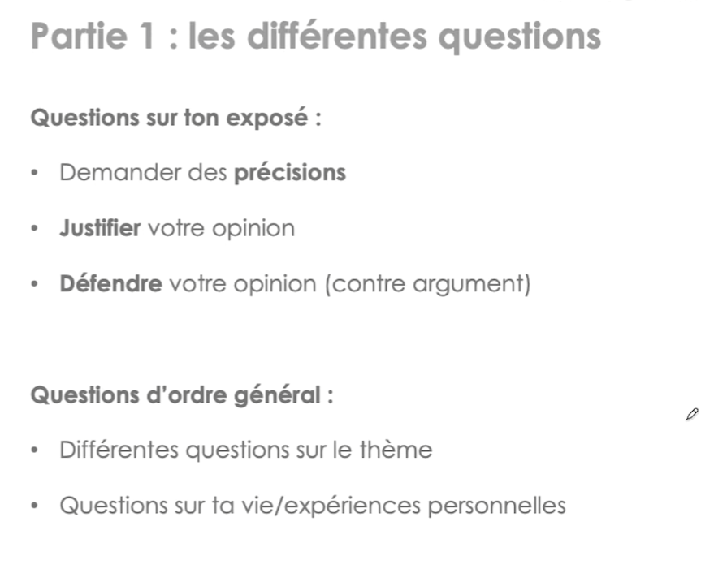
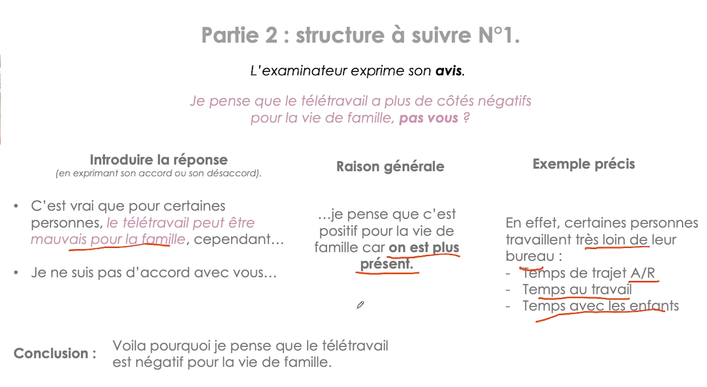
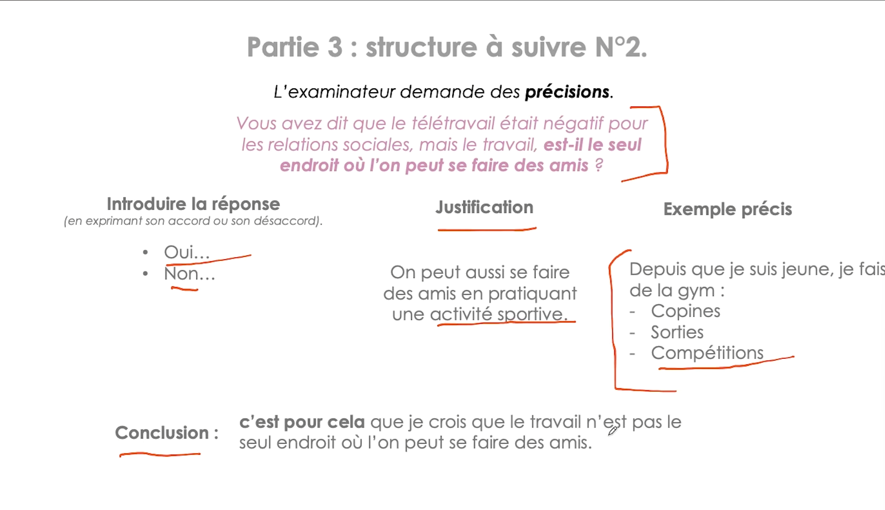
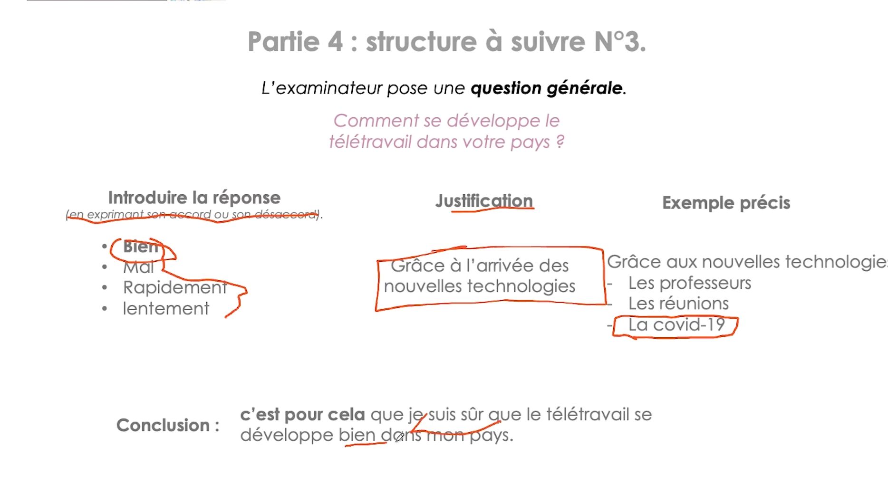
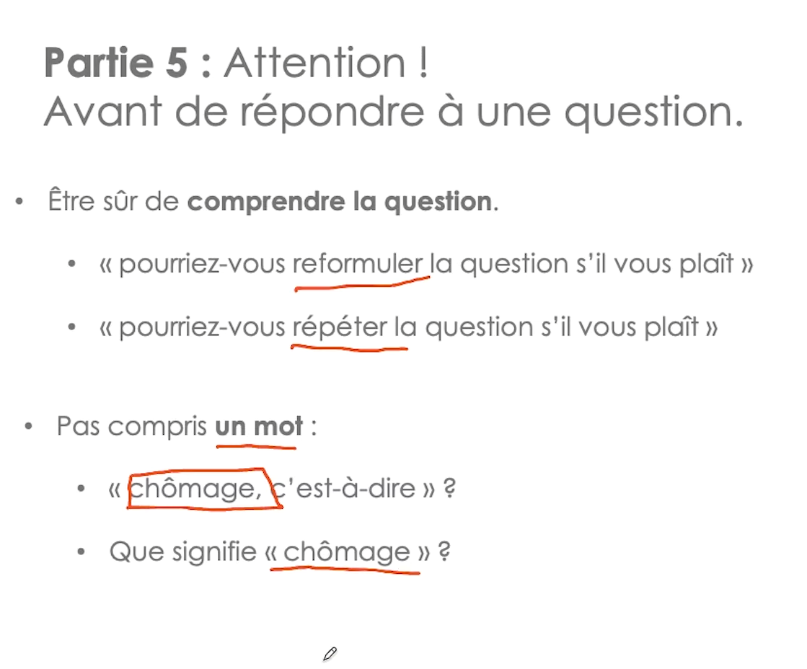

# Production orale : Débat

Reussir le débat

### [**Part 2: Discussion (15 minutes)**](https://savoirx.ai/articles/delf-speaking-test-production-orale-guide#part-2-discussion-15-minutes)

The examiner challenges your position, asks for clarification, and explores the topic deeper.

**What to expect:**

- Questions about your arguments
- Counterarguments you must address
- Requests for examples or evidence
- Exploration of nuances

**Tips:**

- Stay calm when challenged
- Acknowledge valid points from the examiner
- Use nuancing expressions: *certes...mais, il est vrai que...cependant*
- Be ready to adjust your position if needed

Excusez-moi, que signifie “chômage”?

Excusez-vous, que voulez-vous dire par “chômage”